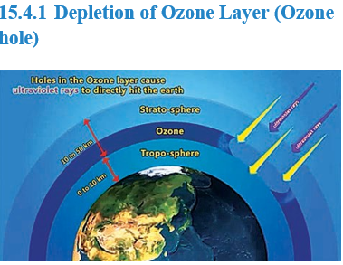

At high altitudes to the atmosphere consists of a layer of ozone (O3) which acts as an umbrella or shield for harmful UV radiations. It protects us from harmful effect such as skin cancer. UV radiation can convert molecular oxygen into ozone as shown in the following reaction.

$\ce{O2 (g) ->[{uv}]O(g) + O(g)}$

$\ce{O (g) + O2 (g)  ->[{ uv}]O3(g)}$

Ozone gas is thermodynamically unstable and readily decomposes to molecular oxygen

# Depletion of Ozone Layer (Ozone hole)

**Fig 5 Ozone Depletion**

In recent years, a gradual depletion of this protective ozone layer has been reported. Nitric oxide and CFC are found to be most responsible for depletion of ozone layer.

Generally substances that cause depletion of ozone or make it thinner are called Ozone Depletion Substances abbreviated as ODS. The loss of ozone molecules in the upper atmosphere is termed as depletion of stratospheric ozone.

**Oxides of Nitrogen:**

Nitrogen oxides introduced directly into the stratosphere by the supersonic jet aircraft engines in the form of exhaust gases.

These oxides are also released by combustion of fossil fuels and nitrogen fertilizers. Inert nitrous oxide in the stratosphere is photo chemically converted into more reactive nitric oxide. O x i d e s of nitrogen catalyse the decomposition of ozone and are themselves regenerated. Ozone gets depleted as shown below.

  
$\ce{NO +O3 ->NO2 +O2 }$

$\ce{O2 ->[{hυ}]O + O}$

$\ce{NO2 +O ->NO+O2}$

Thus NO is regenerated in the chain reaction.

**Chloro Fluoro Carbons (CFC) Freons**

The chloro fluoro derivatives of methane and ethane are referred by trade name Freons. These Chloro Fluoro Carbon compounds are stable, non-toxic, noncorrosive and non-inflammable, easily liquefiable and are used in refrigerators, air- conditioners and in the production of plastic foams. CFC’s are the exhaust of supersonic air craft’s and jumbo jets flying in the upper atmosphere. They slowly pass from troposphere to stratosphere. They stay for very longer period of 50 - 100 years. In the presence of uv radiation, CFC’s break up into chlorine free radical

$\ce{CF2 Cl2 ->[{hυ}]•CF2 Cl + Cl•}$

$\ce{CFCl3 ->[{hυ}] •CFCl2 + Cl•}$

$\ce{Cl• + O3 -> ClO• + O2}$

$\ce{ClO• + (O) -> Cl• + O2}$

 

Chlorine radical is regenerated in the course of reaction. Due to this continuous attack of Cl˚ thinning of ozone layer takes place which leads to formation of ozone hole.

It is estimated that for every reactive chlorine atom generated in the stratosphere 1,00,000 molecules of ozone are depleted.

# Environmental Impact of Ozone Depletion

The formation and destruction of ozone is a regular natural process, which never disturbs the equilibrium level of ozone  

in the stratosphere. Any change in the equilibrium level of the ozone in the atmosphere will adversely affect life in the biosphere in the following ways.

Depletion of ozone layer will allow more UV rays to reach the earth surface and layer would cause skin cancer and also decrease the immunity level in human beings.

UV radiation affects plant proteins which leads to harmful mutation of cells.

UV radiation affects the growth of phytoplankton, as a result ocean food chain is disturbed and even damages the fish productivity.
